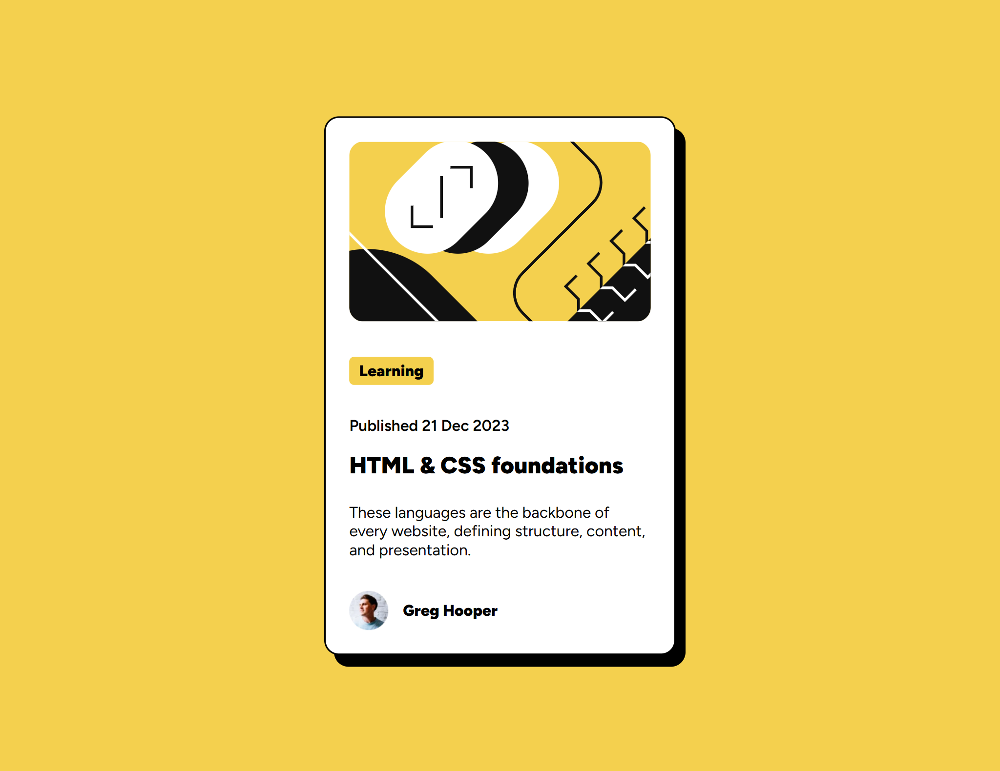

# Frontend Mentor - Blog preview card component

This is my solution to the [Blog preview card component challenge on Frontend Mentor](https://www.frontendmentor.io/challenges/blog-preview-card-ckPaj01IcS).

## 📸 Screenshot

## 🔗 Links

- Live Site URL: [Blog Preview Card - Live](https://telmomanduco.github.io/blog-preview-card-main/
)
- Solution on Frontend Mentor: [Frontend Mentor Preview Card - Live](https://www.frontendmentor.io/solutions/blog-preview-card-built-with-flex-crHkcCzpqK)

## 💻 Built with

- Semantic HTML5
- CSS Flexbox
- Mobile-first workflow
- Google Fonts (Figtree)

## 🚀 What I learned

While building this component, I practiced:

- Structuring semantic HTML for accessibility
- Using `flex` to align content properly
- Styling hover effects and buttons
- Improving consistency with font sizing and spacing

## 🧠 Continued development

In future projects, I want to:

- Work more with responsive layouts
- Explore accessibility improvements
- Practice using `rem`/`em` units consistently

## 🙋‍♂️ Author

- GitHub: [@TelmoManduco](https://github.com/TelmoManduco)
- Frontend Mentor: [@TelmoManduco](https://www.frontendmentor.io/profile/TelmoManduco)

